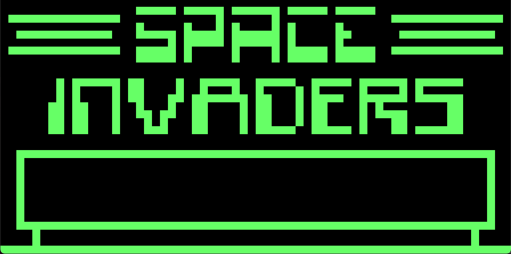

# Chippy : CHIP-8 interpreter

## Description
This is a basic CHIP-8 interpreter that has been made for learning purposes and for fun :)

You can build and run the project with the descriptions below.

## Dependencies

- [SDL2](https://www.libsdl.org)

## Build
Run the following commands in a command terminal to build the program.

        git clone https://github.com/FvK91/Chippy.git
        cd Chippy
        cmake ./
        make

## Usage
Run the following command in a command terminal to run te program. 
The IPS (_instructions per second_) parameter is optional (default = 1000).

         ./Chippy [path_to_ROM] [IPS]

Example:
        
        ./Chippy ./dat/IBM_Logo.ch8 700

## Keypad
        CHIP-8 Keypad       Mapped Keypad

            1 2 3 C            1 2 3 4
            4 5 6 D     =>     Q W E R
            7 8 9 E     =>     A S D F
            A 0 B F            Z X C V
        

## Output
This is what a game of Space Invaders looks like:

